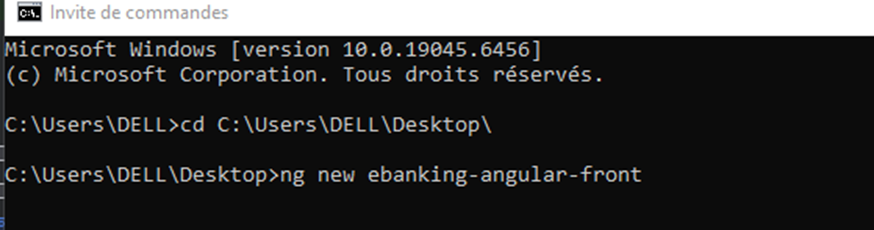
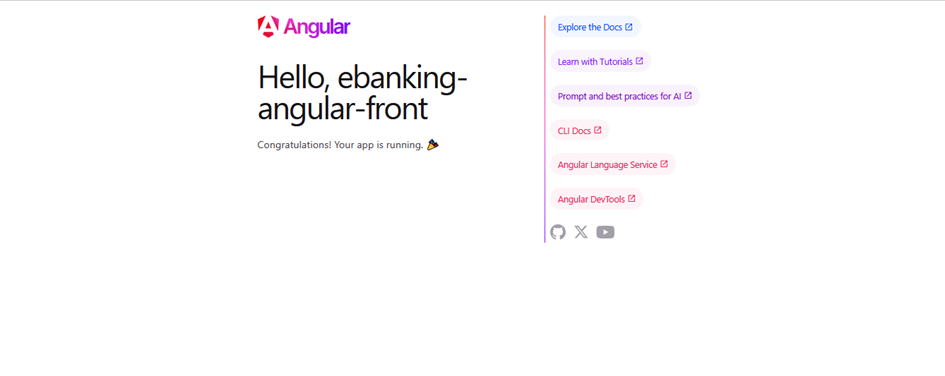
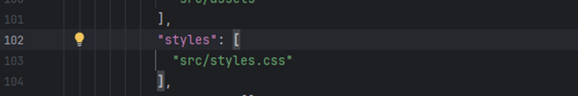
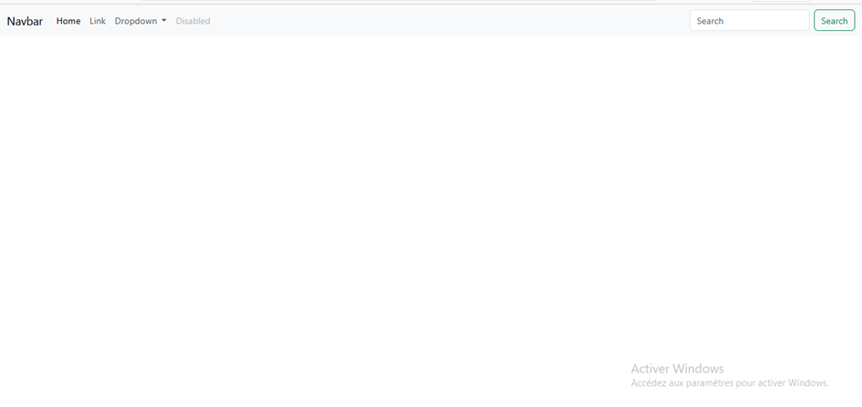
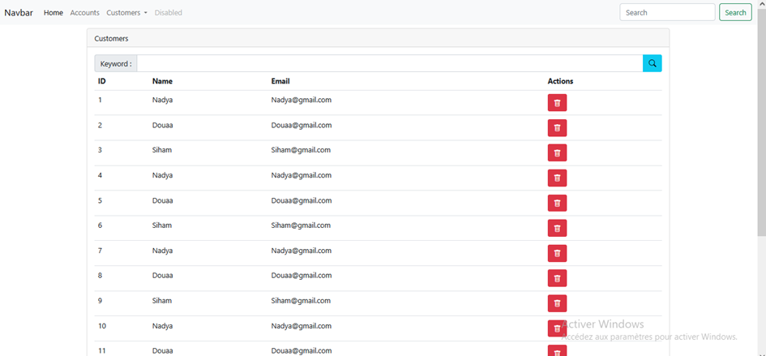
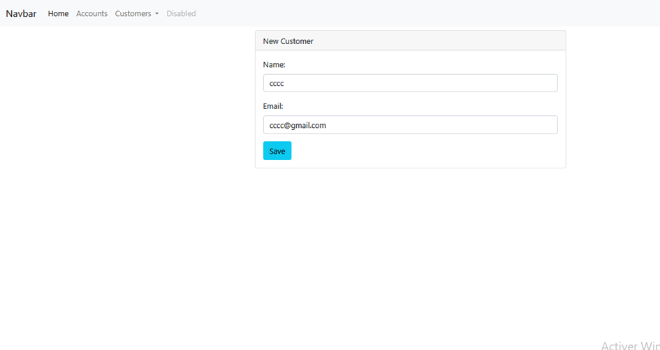
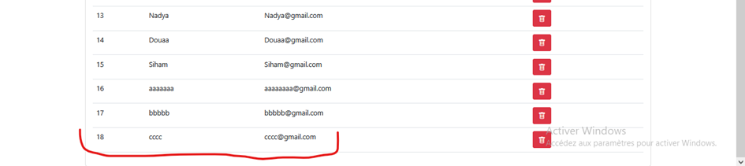
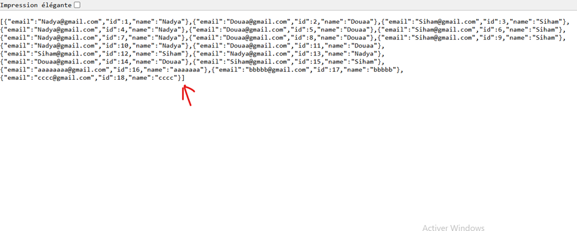

# Projet Frontend Angular

Ce projet est un projet frontend développé avec **Angular**, incluant l'intégration de **Bootstrap** et des icônes pour améliorer le design et l'expérience utilisateur.

---

## Installation des dépendances

Pour commencer, nous devons installer Bootstrap et les icônes nécessaires :


npm install bootstrap
npm install bootstrap-icons


---

## Création du projet

Pour créer le projet Angular, utilisez la commande suivante :

```bash
ng new nom-du-projet
```

Ensuite, ouvrez le projet dans votre éditeur préféré et structurez-le selon vos besoins.

### Aperçu de la création du projet




---

## Tester l’application

Une fois le projet créé, vous pouvez lancer l’application pour vérifier qu’Angular fonctionne correctement :

```bash
ng serve
```

Puis ouvrez votre navigateur à l’adresse : `http://localhost:4200/`

### Aperçu du test de l’application



---

## Utilisation de Bootstrap dans Angular

Pour intégrer Bootstrap correctement, il faut modifier le fichier `angular.json`.

### Étape 1 : Localiser les fichiers CSS et scripts par défaut

Par défaut, vous trouverez déjà une configuration CSS dans `angular.json` :



### Étape 2 : Ajouter Bootstrap

Ajoutez les lignes suivantes pour inclure Bootstrap :

```json
"styles": [
    "node_modules/bootstrap/dist/css/bootstrap.min.css",
    "src/styles.css"
],
"scripts": [
    "node_modules/bootstrap/dist/js/bootstrap.bundle.min.js"
]
```

---

## Premier test avec Bootstrap

Après avoir configuré Bootstrap, vous pouvez effectuer un premier test pour vérifier que le style et les composants fonctionnent correctement.

### Aperçu du premier test



---

## Test avec le backend (Customers)

Maintenant, nous allons tester l’intégration avec le backend pour gérer les customers.



### Ajouter un customer

Vous pouvez ajouter un nouveau customer via l’interface :



### Vérifier l’ajout

Après ajout, vous pouvez voir que le customer est bien enregistré :



---

## Aperçu final

Voici quelques captures d’écran supplémentaires pour illustrer le fonctionnement de l’application :




---

## Conclusion

Cette application Angular permet de :

* Créer un projet frontend structuré.
* Intégrer Bootstrap et les icônes pour un design réactif.
* Tester l’application localement.
* Interagir avec un backend pour gérer des données (exemple : Customers).


## Rédigé par : Nadya EL ABBASSI 

